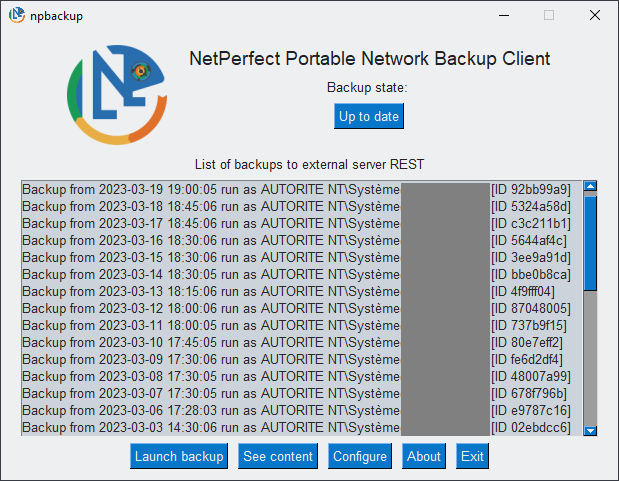
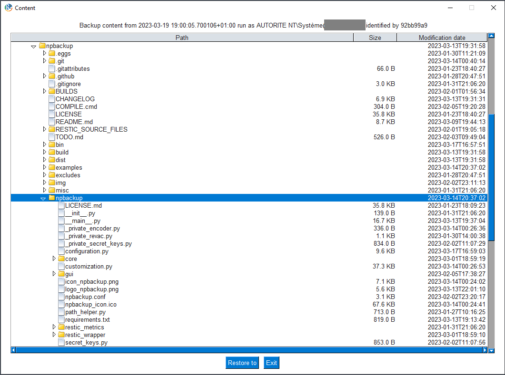
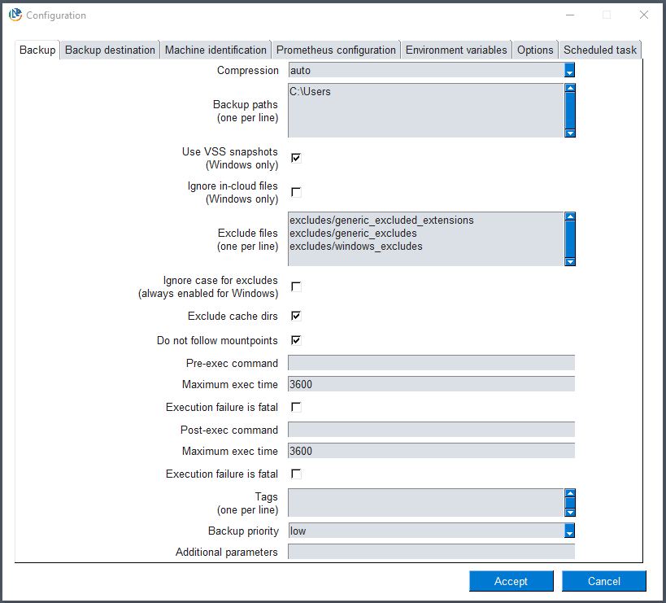
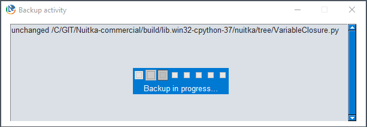
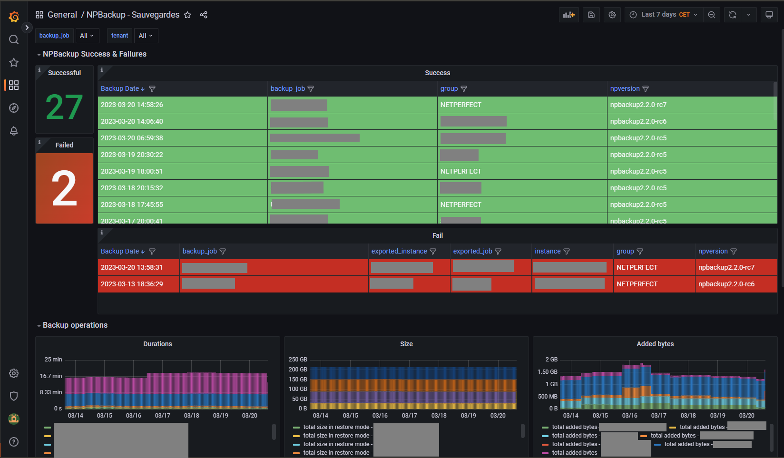

[](https://opensource.org/licenses/GPL-3.0)
[](http://isitmaintained.com/project/netinvent/npbackup "Percentage of issues still open")
[](https://github.com/netinvent/npbackup/releases/latest)


# NPBackup

A secure and efficient file backup solution that fits both system administrators (CLI) and end users (GUI)

Works on **Linux** x64, and arm/arm64 based **NAS** solutions, and **Windows** x64 and x86.

## Features

- Data deduplication and fast zstd compression
- Client side data encryption
- Wide storage backend support
  - local files
  - SFTP
  - High performance HTTP REST server
  - Amazon S3/Minio/Wasabi
  - Blackblaze B2
  - Microsoft Azure Blob Storage
  - Google Cloud Storage
  - OpenStack Swift
  - Alibaba Cloud (Aliyun) Object Storage System (OSS)
- Resume on interrupted backups
- Full CLI interface for scheduled task usage
  - Checks for recent backups before launching a backup
- End User GUI
  - Backups create, list, viewer and restore
  - Full configuration interface
  - Internationalization support (en, fr as of feb 2023)
- Performance
  - Backup process and IO priority settings
  - Upload / download speed limits
  - Remote connectivity concurrency settings
- Comes with full exclusion lists for Linux and Windows
- First class prometheus support
  - Restic results metric generatioion
  - Grafana dashboard included
  - node_exporter file collector support
  - Optional push gateway metrics uploading
- First class Windows support
  - VSS snapshots
  - Automatic cloud file exclusions (reparse points)
  - Windows pre-built executables
  - Windows installer
- Additional security
  - repository uri / password, http metrics and upgrade server passwords are AES-256 encrypted
  - Encrypted data viewing requires additional password
  - AES-256 keys can't be guessed in executables thanks to Nuitka Commercial compiler
- Easy configuration via YAML file (or via GUI)
- Remote automatic self upgrade capacity
  - Included upgrade server ready to run in production

## About

So, a new backup solution out of nowhere, packed with too much features for it's own good ? Not really !

NPBackup relies on the well known [restic](https://restic.net) backup program, which has been battle proven for years.
While restic is a fanstastic program, NPBackup expands restic by offering a wider set of features.

## Quickstart

You may install npbackup via PyPI or use the pre-built executables.

### Prebuilt executables
On linux, copy `npbackup` executable to `/usr/local/bin` and make it executable via `chmod +x /usr/local/bin/npbackup`. Any distribution with glibc >= 2.17 should do.

On Windows, you can directly execute `npbackup.exe` or use `NPBackupInstaller.exe` to install NPBackup into program files and create a run schedule.
The x64 binary is compatible with Windows 10+. The x86 binary is compatible with windows Vista and higher. On those old systems, you might need to install Visual C runtime 2015.

### PyPI installation

If you don't want to use the pre-built executables, you can install via pip with `pip install npbackup`.

Python requirement: 3.6+

Note that if you want to use the GUI, you'll also need to install tkinter via `yum install python-tkinter` or `apt install python3-tk`.

### Setup

Copy the example config from model `examples/npbackup.conf.dist` into the directory where npbackup is installed.  
Also copy the `excludes` directory if you plan to use the prefilled bigger exclusion lists for your backups.

You can adjust the parameters directly in the file, or via a config GUI by launching `npbackup --config-file=npbackup.conf --config-gui`

Once configured, you can launch manual backups via `npbackup --backup`. Those can be scheduled.
Windows schedule is created automatically by the installer program. On Linux, you'll have to create a cronjob or a systemd timer.

Since NPBackup is configured to only proceed with backups when no recent backups are detected, you should consider scheduling npbackup executions quite often.
The default schedule should be somewhere around 15 minutes.

You can use `npbackup --list` or the GUI to list backups.

The GUI allows an end user to check current backups & restore files.rom backups:

The YAML configuration file encrypts sensible data so the end user doesn't have to know repository URI or password.

## Quickstart GUI

Just run the npbackup executable and configure it.
Prebuilt binaries can be found [here](https://github.com/netinvent/npbackup/releases)



Main minimalistic interface allows to: 
 - List current backups
 - Launch a manual backup
 - See if last backup is recent enough



Restore window allows to browse through backups and select what files to restore.



Configuration allows to edit the YAML configuration files directly as end user



Backup process is interactive when GUI is used

**Security**
NPBackup' security model relies on symmetric encryption of all sensible data that allows to access a repository.  
In order to achieve this, NPBackup contains an AES-KEY that can be set:
 - at compile time
 - at run time via an AES-KEY file

Please note that right clicking on "<encrypted data>" in the configuration GUI will allow to decrypt that data, by prompting a backup admin password.
That password is set at compile-time and should be different depending on the organization.

This allows a system admin to see repo URI and passwords, without leaving this information available on the computer.

The configuration file should never be world readable, as one could change the backup admin password, allowing to decrypt other parts of the conf file.

## The difficulty of laptop backups

As a matter of fact, laptop backups are the hardest. No one can predict when a laptop is on, and if it has access to internet.
Creating a backup strategy in those cases isn't a simple task.

NPBackup solves this by checking every 15 minutes if a backup newer than 24h exists.
If so, nothing is done. In the case no recent backup exists, a backup is immediately launched.
OF course, both time options are configurable.
In order to avoid sluggish user experience while backing up, process and io priority can be lowered.
Once done, NPBackup can send backup results in Prometheus format directly to a push gateway, for prometheus to catch them.

## A good server backup solution

Server backups can be achieved by setting up a scheduled task / cron job.

Of course, since NPBackup supports pre-exec and post-exec commands, it can be used to backup various services like virtual hosts or databases where snapshot/dump operations are required.
When run on a server, prometheus support can be shifted from a push gateway to a file, which will be picked up by node_exporter file collector.:

## Monitoring

NPBackup includes full prometheus support, including grafana dashboard.
On servers, we'll configure a prometheus file that gets written on each backup, and later can be collected by node_exporter.

On laptops, since we might be away from our usual network, we'll push the backup metrics to a remote push gateway which laters gets collected by prometheus itself.

The current NPBackup dashboard:


## End user expericence

While admin user experience is important, NPBackup also offers a GUI for end user experience, allowing to list all backup contents, navigate and restore files, without the need of an admin. The end user can also check if they have a recent backup completed, and launch backups manually if needed.

## Security

NPBackup inherits all security measures of it's backup backend (currently restic with AES-256 client side encryption including metadata), append only mode REST server backend.

On top of those, NPBackup itself encrypts sensible information like the repo uri and password, as well as the metrics http username and password.  
This ensures that end users can restore data without the need to know any password, without compromising a secret. Note that in order to use this function, one needs to use the compiled version of NPBackup, so AES-256 keys are never exposed. Internally, NPBackup never directly uses the AES-256 key, so even a memory dump won't be enough to get the key.

## Upgrade server

NPBackup comes with integrated auto upgrade function that will run regardless of program failures, in order to lessen the maintenance burden.  
The upgrade server runs a python asgi web server with integrated HTTP basic authentication, that can further be put behind an SSL proxy like HaProxy.

## Compilation

In order to fully protect the AES key that is needed to support NPBackup, one can compile the program with Nuitka.
Compiling needs restic binary for the target platform in `RESTIC_SOURCE_FILES` folder, files must be named `restic_{version}_{platform}_{arch}[.extension]` like provided by restic.net or [github](github.com/restic/restic)
Linux binaries need to be made executable in the `RESTIC_SOURCE_FILES` folder.

You'll need to change the default AES key in `secrets.py`, see the documentation in the file itself.

Compile options are available in `compile.py`.

We maintain a special 32 bit binary for Windows 7 which allows to backup those old machines until they get replaced.

We also compile our linux target on RHEL 7 in order to be compatible with reasonably old distributions (>= glibc 2.17).

arm and arm64 builds are compiled on Debian stretch for use with glibc > 2.24.
Additionnaly, arm builds are compiled without GUI support since they're supposed to fit on smaller devices like NAS / Raspberries.

## Smart shield, antivirus and reputation

Official binaries for Windows provided by NetInvent are signed with a certificate, allowing to gain trust and reputation in antivirus analysis.  
Also, official binaries are compiled using Nuitka Commercial grade, which is more secure in storing secrets.  

Pre-compiled builds for Windows have been code signed with NetInvent's EV certificate, using [windows_tools.signtool](github.com/netinvent/windows_tools)  
Signing on a Windows machine with Windows SDK installed:
```
from windows_tools.signtool import SignTool
signer = SignTool()
signer.sign(r"c:\path\to\executable", bitness=64)
```

## Misc

NPBackup supports internationalization and automatically detects system's locale.
Still, locale can be overrided via an environment variable, eg on Linux:
```
export NPBACKUP_LOCALE=en
```
On Windows:
```
set NPBACKUP_LOCALE=en
```

## Special thanks

- Thanks to the Restic Team without which this program would not be possible
- Thanks to https://github.com/Krutyi-4el who packaged i18nice internationalization for us
- Special thanks to the BTS SIO 2nd year class of 2022 at Lycee Marillac / Perpignan who volunteered as GUI Q&A team
